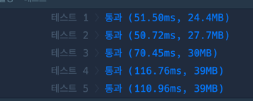
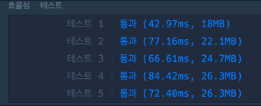

## 폰켓몬 문제
프로그래머스 ex1번 문제

문제 설명
당신은 폰켓몬을 잡기 위한 오랜 여행 끝에, 홍 박사님의 연구실에 도착했습니다.  
홍 박사님은 당신에게 자신의 연구실에 있는 총 N 마리의 폰켓몬 중에서 N/2마리를 가져가도 좋다고 했습니다.  
홍 박사님 연구실의 폰켓몬은 종류에 따라 번호를 붙여 구분합니다. 따라서 같은 종류의 폰켓몬은 같은 번호를 가지고 있습니다.  
예를 들어 연구실에 총 4마리의 폰켓몬이 있고,  
각 폰켓몬의 종류 번호가 [3번, 1번, 2번, 3번]이라면 이는 3번 폰켓몬 두 마리, 1번 폰켓몬 한 마리, 2번 폰켓몬 한 마리가 있음을 나타냅니다.  
이때, 4마리의 폰켓몬 중 2마리를 고르는 방법은 다음과 같이 6가지가 있습니다.

첫 번째(3번), 두 번째(1번) 폰켓몬을 선택  
첫 번째(3번), 세 번째(2번) 폰켓몬을 선택  
첫 번째(3번), 네 번째(3번) 폰켓몬을 선택  
두 번째(1번), 세 번째(2번) 폰켓몬을 선택  
두 번째(1번), 네 번째(3번) 폰켓몬을 선택  
세 번째(2번), 네 번째(3번) 폰켓몬을 선택  
이때, 첫 번째(3번) 폰켓몬과 네 번째(3번) 폰켓몬을 선택하는 방법은 한 종류(3번 폰켓몬 두 마리)의 폰켓몬만 가질 수 있지만, 다른 방법들은 모두 두 종류의 폰켓몬을 가질 수 있습니다.  
따라서 위 예시에서 가질 수 있는 폰켓몬 종류 수의 최댓값은 2가 됩니다.  
당신은 최대한 다양한 종류의 폰켓몬을 가지길 원하기 때문에, 최대한 많은 종류의 폰켓몬을 포함해서 N/2마리를 선택하려 합니다.   
N마리 폰켓몬의 종류 번호가 담긴 배열 nums가 매개변수로 주어질 때, N/2마리의 폰켓몬을 선택하는 방법 중, 가장 많은 종류의 폰켓몬을 선택하는 방법을 찾아,  
그때의 폰켓몬 종류 번호의 개수를 return 하도록 solution 함수를 완성해주세요.

제한사항  
nums는 폰켓몬의 종류 번호가 담긴 1차원 배열입니다.  
nums의 길이(N)는 1 이상 10,000 이하의 자연수이며, 항상 짝수로 주어집니다.  
폰켓몬의 종류 번호는 1 이상 200,000 이하의 자연수로 나타냅니다.  
가장 많은 종류의 폰켓몬을 선택하는 방법이 여러 가지인 경우에도, 선택할 수 있는 폰켓몬 종류 개수의 최댓값 하나만 return 하면 됩니다.  
입출력 예  
nums	result  
[3,1,2,3]	2  
[3,3,3,2,2,4]	3  
[3,3,3,2,2,2]	2  
입출력 예 설명  
입출력 예 #1  
문제의 예시와 같습니다.  

입출력 예 #2  
6마리의 폰켓몬이 있으므로, 3마리의 폰켓몬을 골라야 합니다.  
가장 많은 종류의 폰켓몬을 고르기 위해서는 3번 폰켓몬 한 마리, 2번 폰켓몬 한 마리, 4번 폰켓몬 한 마리를 고르면 되며, 따라서 3을 return 합니다.  

입출력 예 #3  
6마리의 폰켓몬이 있으므로, 3마리의 폰켓몬을 골라야 합니다.  
가장 많은 종류의 폰켓몬을 고르기 위해서는 3번 폰켓몬 한 마리와 2번 폰켓몬 두 마리를 고르거나, 혹은 3번 폰켓몬 두 마리와 2번 폰켓몬 한 마리를 고르면 됩니다.  
따라서 최대 고를 수 있는 폰켓몬 종류의 수는 2입니다.  

### 문제 해설 방식
1) 이 문제를 풀려면 가장 중요한 것은 박사님이 가진 총 포켓몬의 종류를 파악해야함.
2) 예시 2번에 의하면 마리수가 많아도 얻을 수 있는 종류는 2개 이기때문에.
3) 따라서 총 포켓몬의 종류를 알기 위해 set을 사용함 
   - 각 종류마다 몇마리인지는 파악하지 않아도 되기때문에
   - 만약 그랬다면 dict형식을 사용해야할듯
4) 해당 총 종류 수가  총 마리수 // 2 보다 크다면 총 마리수 // 2를 반환함
5) 그게 아니라면 총 종류 수를 반환함.

### 추가 해설
min을 사용한 비교도 괜찮아보임!
하지만 단순 2개를 비교하는 것은 min보다는 if문이 훨씬 빠름.  
따라서 만약 list가 아니고, 루프 시에 비교하게 된다면 if문을 통해서 비교하는 게 나음.

## 완주하지 못한 선수
### 문제 설명  
수많은 마라톤 선수들이 마라톤에 참여하였습니다.  
단 한 명의 선수를 제외하고는 모든 선수가 마라톤을 완주하였습니다.  

마라톤에 참여한 선수들의 이름이 담긴 배열 participant와 완주한 선수들의 이름이 담긴 배열 completion이 주어질 때, 완주하지 못한 선수의 이름을 return 하도록 solution 함수를 작성해주세요.  

제한사항  
마라톤 경기에 참여한 선수의 수는 1명 이상 100,000명 이하입니다.  
completion의 길이는 participant의 길이보다 1 작습니다.  
참가자의 이름은 1개 이상 20개 이하의 알파벳 소문자로 이루어져 있습니다.  
참가자 중에는 동명이인이 있을 수 있습니다.  
입출력 예  
participant	completion	return  
["leo", "kiki", "eden"]	["eden", "kiki"]	"leo"  
["marina", "josipa", "nikola", "vinko", "filipa"]	["josipa", "filipa", "marina", "nikola"]	"vinko"  
["mislav", "stanko", "mislav", "ana"]	["stanko", "ana", "mislav"]	"mislav"  
입출력 예 설명  
예제 #1  
"leo"는 참여자 명단에는 있지만, 완주자 명단에는 없기 때문에 완주하지 못했습니다.  

예제 #2  
"vinko"는 참여자 명단에는 있지만, 완주자 명단에는 없기 때문에 완주하지 못했습니다.  

예제 #3  
"mislav"는 참여자 명단에는 두 명이 있지만, 완주자 명단에는 한 명밖에 없기 때문에 한명은 완주하지 못했습니다.  

※ 공지 - 2023년 01월 25일 테스트케이스가 추가되었습니다.  

### 문제 해설
1) 전체 참가자 list에서 remove를 통해 완주자 이름을 뺀다.
2) 마지막 남은 참가자를 return한다.
3) 이렇게 되면 정확성은 맞지만 효율성이 떨어진다.
4) 이유는 remove시 걸리는 시간 복잡도는 O(n)이기에
5) 실제로 O((n-1)*n) 즉 n^2의 시간이 걸리기 떄문이다.

따라서 2번 방안으로 진행.
1) 참가자 리스트와 완주자 리스트를 정렬함.
2) index를 통해 값을 비교하여 다른 곳이 있다면 해당 참가자가 완주하지 못한 참가자임
3) 해당 참가자를 return함.
4) 끝까지 같다면 마지막 참가자가 완주하지 못한 참가자이기에 마지막 return문 추가

### 다른 사람들 풀이

Counter 사용
1) Counter는 list나 string을 분리하여 dict형식으로 정리해주는 객체이다.
2) "12345"는 Counter('1':1, '2':1, '3':1, '4':1, '5':1) 이런식으로 표현된다.
3) 산술연산도 가능하고, 최댓값 최솟값 찾기도 가능하다.
counter 사용 시 효율성 메모리와 걸린 시간이다.

아래는 직접 sort 시 효율성 메모리와 걸린 시간이다.

효율성과 걸린 시간은 위의 직접 소트 후 비교하는 방식이 더 낫다.

## 전화번호 목록
### 문제 설명  
전화번호부에 적힌 전화번호 중, 한 번호가 다른 번호의 접두어인 경우가 있는지 확인하려 합니다.  
전화번호가 다음과 같을 경우, 구조대 전화번호는 영석이의 전화번호의 접두사입니다.  

구조대 : 119  
박준영 : 97 674 223  
지영석 : 11 9552 4421  
전화번호부에 적힌 전화번호를 담은 배열 phone_book 이 solution 함수의 매개변수로 주어질 때,  
어떤 번호가 다른 번호의 접두어인 경우가 있으면 false를 그렇지 않으면 true를 return 하도록 solution 함수를 작성해주세요.  

제한 사항  
phone_book의 길이는 1 이상 1,000,000 이하입니다.  
각 전화번호의 길이는 1 이상 20 이하입니다.  
같은 전화번호가 중복해서 들어있지 않습니다.  
입출력 예제  
phone_book	return  
["119", "97674223", "1195524421"]	false  
["123","456","789"]	true  
["12","123","1235","567","88"]	false  
입출력 예 설명  
입출력 예 #1  
앞에서 설명한 예와 같습니다.  

입출력 예 #2  
한 번호가 다른 번호의 접두사인 경우가 없으므로, 답은 true입니다.  

입출력 예 #3  
첫 번째 전화번호, “12”가 두 번째 전화번호 “123”의 접두사입니다. 따라서 답은 false입니다.  

알림  

2021년 3월 4일, 테스트 케이스가 변경되었습니다. 이로 인해 이전에 통과하던 코드가 더 이상 통과하지 않을 수 있습니다.  

### 문제 풀이
정렬을 이용한 문제풀이
1) sort 기능을 통해 바로 뒤의 값과 비교만 하면 됨.
   - 예시로 ['118', '119', '1181', '1191', '115'] 이 존재한다면
   - 정렬 시 ['115', '118', '1181', '119', '1191']의 결과를 얻을 수 있음.
   - 이것은 string의 특성임. 각 자리수마다 비교하기때문에.
   - 따라서 for문 1회를 통해 바로 뒷값과 비교만 한다면 포함 여부를 확인할 수 있음.
2) 비교 시 string의 특성인 .startwith를 사용할 수도 있지만, 나는 앞의 자리수만큼 잘라서 비교함.

## 의상
### 문제 설명
코니는 매일 다른 옷을 조합하여 입는것을 좋아합니다.
예를 들어 코니가 가진 옷이 아래와 같고, 오늘 코니가 동그란 안경, 긴 코트, 파란색 티셔츠를 입었다면  
다음날은 청바지를 추가로 입거나 동그란 안경 대신 검정 선글라스를 착용하거나 해야합니다.

종류	이름  
얼굴	동그란 안경, 검정 선글라스  
상의	파란색 티셔츠  
하의	청바지  
겉옷	긴 코트  
코니는 각 종류별로 최대 1가지 의상만 착용할 수 있습니다.  
예를 들어 위 예시의 경우 동그란 안경과 검정 선글라스를 동시에 착용할 수는 없습니다.  
착용한 의상의 일부가 겹치더라도, 다른 의상이 겹치지 않거나, 혹은 의상을 추가로 더 착용한 경우에는 서로 다른 방법으로 옷을 착용한 것으로 계산합니다.  
코니는 하루에 최소 한 개의 의상은 입습니다.  
코니가 가진 의상들이 담긴 2차원 배열 clothes가 주어질 때 서로 다른 옷의 조합의 수를 return 하도록 solution 함수를 작성해주세요.  

제한사항  
clothes의 각 행은 [의상의 이름, 의상의 종류]로 이루어져 있습니다.  
코니가 가진 의상의 수는 1개 이상 30개 이하입니다.  
같은 이름을 가진 의상은 존재하지 않습니다.  
clothes의 모든 원소는 문자열로 이루어져 있습니다.  
모든 문자열의 길이는 1 이상 20 이하인 자연수이고 알파벳 소문자 또는 '_' 로만 이루어져 있습니다.  
입출력 예  
clothes	return  
[["yellow_hat", "headgear"], ["blue_sunglasses", "eyewear"], ["green_turban", "headgear"]]	5  
[["crow_mask", "face"], ["blue_sunglasses", "face"], ["smoky_makeup", "face"]]	3  
입출력 예 설명  
예제 #1  
headgear에 해당하는 의상이 yellow_hat, green_turban이고 eyewear에 해당하는 의상이 blue_sunglasses이므로 아래와 같이 5개의 조합이 가능합니다.  

1. yellow_hat  
2. blue_sunglasses  
3. green_turban  
4. yellow_hat + blue_sunglasses  
5. green_turban + blue_sunglasses  
   

예제 #2  
face에 해당하는 의상이 crow_mask, blue_sunglasses, smoky_makeup이므로 아래와 같이 3개의 조합이 가능합니다.  

1. crow_mask  
2. blue_sunglasses  
3. smoky_makeup  
   ※ 공지 - 2023년 4월 21일 문제 지문이 리뉴얼되었습니다.

### 문제 해결
1) 경우의 수를 찾는 것인데 각 종류 별 갯수를 dict로 셈
2) 다 셌다면 어떤 경우의 수인지 체크해야함.
3) 1번 예제에서 개수가 2개이고, 1개였는데 총 5개가 나옴.
4) 실제로 모든 경우의 수를 센다면 3*2*1이 됨.
5) 그 중 모두 안입는 경우의 수를 -1하면 5가 나옴.
6) 따라서 각 종류별 개수에 +1을 해주면서 곱 누적을 시켜주고,
7) 마지막에 1을 빼면 완료된다.